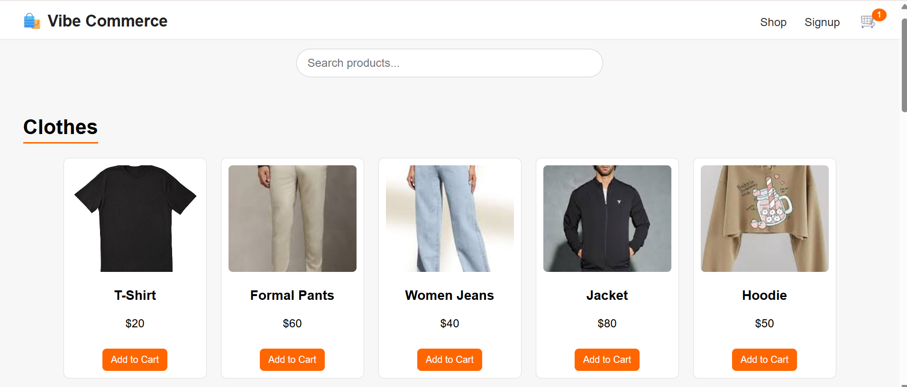
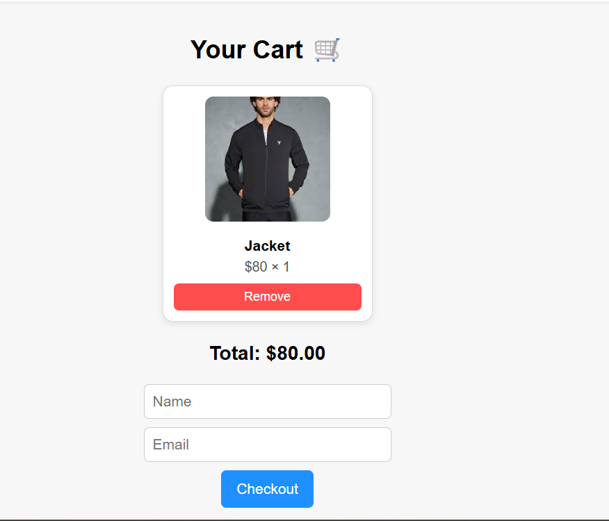
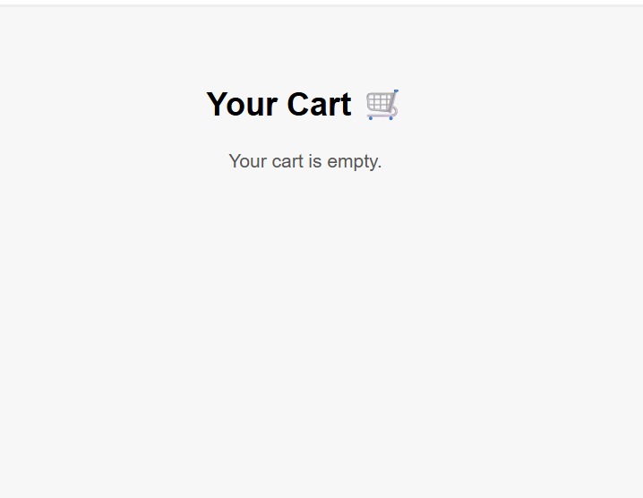
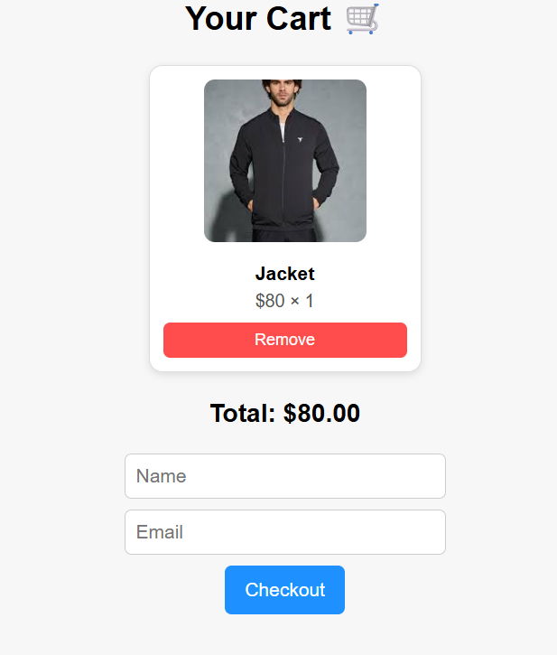
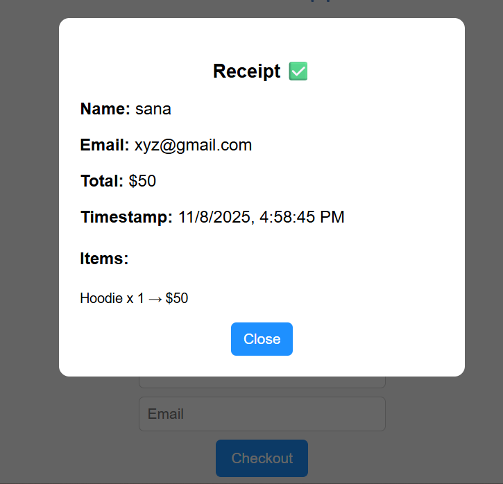

# Vibe Commerce - Full Stack Internship Assignment

## Overview
This is a **mock e-commerce shopping cart application** built for Vibe Commerce internship screening.  
Users can browse products, add/remove items to the cart, view totals, and complete a mock checkout with a receipt.

---

## Tech Stack
- **Frontend:** React.js  
- **Backend:** Node.js, Express  
- **Database:** In-memory (mock data) / optional MongoDB or SQLite  
- **API Type:** REST APIs  
- **Other:** Axios for HTTP requests, CORS  

---

## Features
- Display products in a grid with image, name, price  
- Add items to the cart with quantity management  
- Remove items from the cart  
- View cart totals  
- Checkout form with name/email input  
- Receipt modal showing order details (total, timestamp, items)  
- Responsive design for desktop and mobile  
- Bonus: error handling and “item added to cart” notification  

---

## Installation & Running

### Backend
```bash
cd backend
npm install
node server.js

### Frontend
```bash
cd frontend
npm install
npm start

Frontend runs on http://localhost:3000
Backend runs on http://localhost:5000

---

## 🧠 How It Works
1. **Products Page:** Fetches mock product data from `/api/products`.  
2. **Add to Cart:** Sends a POST request to `/api/cart` to add an item.  
3. **Cart Page:** Displays all cart items with quantities and total price.  
4. **Checkout:** Submits the cart to `/api/checkout` and shows a success receipt.  

---

---

## 🖼️ Screenshots

### 🏠 1. Home / Products Page
Displays all available products with images, names, prices, and “Add to Cart” buttons.  


---

### 🛒 2. Cart Page (Items Added)
Displays cart items with image, name, quantity, price, and total calculation.  


---

### ❌ 3. Removing Item from Cart
Demonstrates removing a product and dynamically updating total amount.  


---

### 🧾 5. Checkout Form
Shows checkout form where user enters name and email before confirming order.  


---

### ✅ 6. Checkout Success Message
Displays “Checkout Successful” message and order receipt after successful purchase.  


---

### 🧮 7. Order Receipt (Summary)
Shows order details — product list, total amount, and timestamp.  



---

## 🗂️ Folder Structure
Vibe-Commerce/
│
├── backend/
│ ├── routes/
│ │ ├── cart.js
│ │ └── products.js
│ ├── data/
│ │ └── products.js
│ ├── server.js
│ └── package.json
│
├── frontend/
│ ├── src/
│ │ ├── components/
│ │ │ ├── Cart.js
│ │ │ └── ProductList.js
│ │ ├── App.js
│ │ └── index.js
│ ├── package.json
│
├── screenshots/
│ ├── products.png
│ ├── cart.png
│ └── receipt.png
│
└── README.md


---

## 🧾 API Endpoints

| Method | Endpoint | Description |
|--------|-----------|-------------|
| **GET** | `/api/products` | Fetch all products |
| **POST** | `/api/cart` | Add an item to the cart |
| **GET** | `/api/cart` | Retrieve all cart items |
| **DELETE** | `/api/cart/:id` | Remove item from cart |
| **POST** | `/api/checkout` | Mock checkout (returns order summary) |

---

## 🧾 Notes
- The backend uses **in-memory data**, so cart resets on server restart.  
- The frontend interacts with backend using **Axios** and REST APIs.  
- Responsive for desktop, tablet, and mobile.  
- Includes error handling and “Item Added to Cart” popups.  

---

## 🎥 Demo Video
Record a **1–2 minute** video using **Loom** or **YouTube (Unlisted)** showing:  
✅ Adding products to the cart  
✅ Removing items  
✅ Successful checkout with receipt display  

👉 Add your video link here once uploaded:  
**Demo Video:** https://www.loom.com/share/f43d1636acad45af953dab1d75209404
---

## ✅ Submission Checklist
✅ Frontend & Backend folders included  
✅ README.md file added  
✅ 3 screenshots in the `/screenshots` folder  
✅ Demo video link added  
✅ Code runs without errors on both sides  
✅ Submitted before deadline  

---

## ✨ Credits
Developed with ❤️ by **SAHANA**  
For **Vibe Commerce Full Stack Internship Assignment** using **React + Node.js + Express**.

